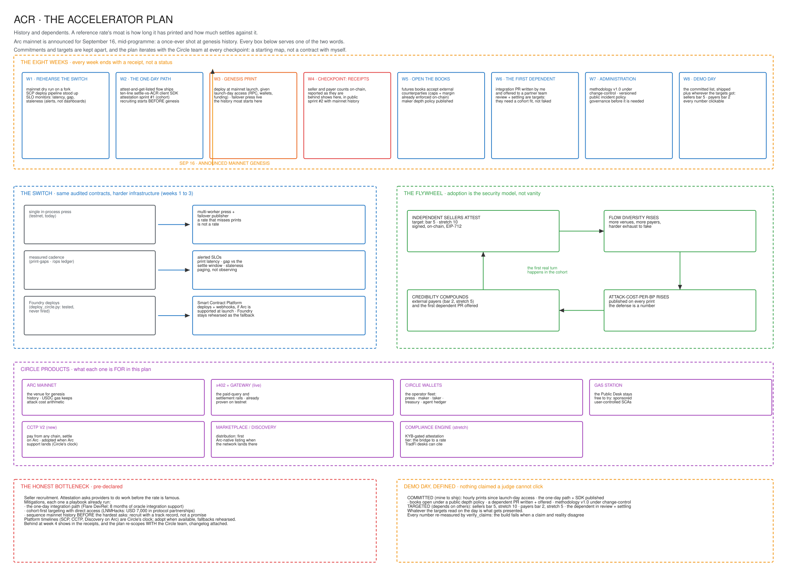

# ACR · The Accelerator Plan

**Eight weeks · Arc mainnet genesis in the middle of them · written to be executed, then checked**

The hackathon proved the methodology. The accelerator turns it into infrastructure, and for a
benchmark, infrastructure means exactly two things money cares about: **history** and
**dependents**. A reference rate's moat is how long it has printed and how much settles against
it. The calendar hands this cohort a once-ever shot at both: **Arc mainnet is announced for
September 16, mid-programme**. Deploy at launch and ACR's price history begins at the genesis
of the market it measures. No later competitor can ever own a longer Arc-native track record.
That window closes at genesis, whenever Circle ships it, and never reopens.

Every week below ends with a receipt rather than a status, because that is how the hackathon
was built: `verify_claims.py` fails the build when a published number and reality disagree, and
that discipline carries into the accelerator unchanged.

Two rules keep this document honest. First, **commitments and targets are kept apart**: a
commitment is work fully inside my control and it ships, while anything that needs another
party (sellers, payers, a protocol team, a platform timeline) is a target with a stated floor,
never a promise. Second, **the plan iterates with the Circle team**: this is the starting map,
not a contract with myself. It gets reviewed at the programme's checkpoints, and wherever
Circle's feedback, their platform timelines, or cohort realities point somewhere better, the
plan re-scopes and the changelog at the bottom says so.

The editable canvas is [`acr_accelerator_plan.excalidraw`](acr_accelerator_plan.excalidraw).

---

## Workstream A · The Switch (weeks 1 to 3): the history moat

Same audited contracts, harder infrastructure. Nothing about the estimator or the contract
surface changes for mainnet; what changes is everything around them, because a rate that misses
prints is not a rate.

**From the single press to a press built not to oversleep.** Today the press is one in-process
hourly loop inside `services/index_api`, and the testnet taught the lesson the hard way, twice: a sleeping free-tier
instance once stretched print gaps to a measured 216 minutes, and even after that was fixed,
one later 153-minute miss slipped past the venue's 120-minute settlement freshness window,
meaning the venue could not have settled for those hours. Mainnet gets two publisher workers behind a leader lock, a watchdog that posts
when the leader misses its slot, and a funded gas runway with its own alarm.

**From measured to alerted.** The cadence tooling already exists and already measures: the
print-gaps walker reads the chain, and the `/ops` systems ledger self-checks every fifteen
minutes. The accelerator turns measurement into paging: SLOs on print latency, gap against the
settle window, and staleness, each one wired to alert an operator instead of waiting to be
read. Observation was the hackathon's bar. Response time is the accelerator's.

**From Foundry to the Smart Contract Platform, if the platform is there.**
`scripts/deploy_circle.py` exists, is unit-tested, and has never deployed anything but a dry
run, which is why the hackathon submission plainly refused to claim it. The mainnet deploy is
where it fires for real, and SCP's contract webhooks come with it, replacing the paged
`eth_getLogs` crawl (a hard cap near 15,000 blocks, plus throttling) that is today's largest
source of operational fragility. The hedge, stated up front: whether SCP supports Arc mainnet
at launch is Circle's timeline, not mine, so the week 1 rehearsal covers both paths and the
Foundry deploy stays ready as the fallback. This is exactly the kind of question I will take to
the Circle team early rather than assume an answer to.

**Week 1 is a full rehearsal on a fork.** Genesis day runs from a checklist, the same way the
submission ran from `SHIP-CHECKLIST.md`. Nothing on launch day is done for the first time.

---

## Workstream B · Adoption (weeks 2 to 8): the flywheel that makes it compound

The commitment here is the **path**: the integration flow, the SDK, and the sprints all ship,
on the weeks named below, because they are mine to ship. The counts are **targets**, because a
count depends on other people saying yes: **five independent attesting sellers as the success
bar, ten as the stretch**, and **two external paying consumers of the x402 API as the bar,
five as the stretch**. Both are measured the way everything here is measured, with receipts
on-chain, and whatever the number is at each checkpoint is the number I report.

**Adoption is the security model, not vanity.** Every independent seller and every basis point
of external flow raises the published attack-cost-per-bp. More adopters make manipulation more
expensive, which makes the rate more credible, which brings more adopters. The accelerator is
where that flywheel gets its first real turn, and the cohort is the natural first market:
inference, GPU and data providers already selling to agents.

**The one-day integration path ships in week 2, before genesis.** Two pieces:

1. **Attest and get listed.** A provider signs one EIP-712 attestation (the registry contract
   and its schema are live today) and lands in the catalog the same day. No integration work
   before the benefit shows up.
2. **Settle against ACR in ten lines.** A client SDK that reads the print, verifies the Circle
   custody signer, and enforces the staleness bound, so a consumer's first integration is an
   afternoon, not a sprint.

**Recruitment is an organizer's motion, and I have run it before.** Attestation sprints inside
the cohort with office hours and same-day listing as the prize. The receipts behind that claim:
I organized and led LNMHacks 6.0 and secured USD 7,000 in protocol partnerships, spent eight
months as a Flare developer ambassador resolving oracle and price-feed integration questions in
real time for teams actively shipping, and wrote a full go-to-market playbook (ICP archetypes,
qualification rubric, conversion cycles) for an Aave indexer product. Sellers are recruited the
way hackathon sponsors and oracle integrators are recruited, and that is a job I have already
done.

**Sequencing is the quiet trick.** Mainnet history is sequenced before the hardest asks: given
launch-day access on the announced date, from week 4 onward I am recruiting with a live genesis
track record instead of a promise, and if the date moves, the sequencing logic moves with it.

---

## Workstream C · Dependents (weeks 4 to 8): the moment it becomes infrastructure

**Open the books (week 5).** The futures venue opens to cash-settlement with external
counterparties; whether strangers actually clear is a target, and the count on the tape is what
gets reported. The hard parts are already on-chain and tested:
initial margin, per-series trader caps, socialized-loss clearing, and the two-hour settlement
freshness bound. What the accelerator adds is a published maker depth policy and position
limits sized for strangers. I have built and run an Avellaneda-Stoikov market maker against a
live venue twice now, once here and once pricing UMA dispute risk on Polymarket with the fills
reconciled exactly against decoded on-chain events, so the book management is a known quantity.

**Build for the first external dependent (week 6).** ACR as settlement oracle for an Arc-native
credit or hedging protocol. Cohort teams are the natural first integrations, and the honest
split is this: what I commit to is the **build**: an integration PR written by me and offered to a
partner team by week 6, plus the published `acr-hedge` Skill that already teaches any agent the
read, verify, hedge loop. Whether that PR **enters review and settles by demo day is a
target**, because both depend on a cohort fit existing and on that team's own timeline. If no fit lands in eight
weeks, the demo falls back to what is already real and labelled as ours: the autonomous hedger
and the Public Desk counterparties. The day another team's product settles against ACR is the
day it stops being a dashboard, and I would rather reach that day honestly a week late than
claim it early.

---

## Workstream D · Administration (throughout): governance is the product

The LIBOR lesson is that rates fail on governance before they fail on math. So the boring parts
ship as features: the methodology paper published openly as v1.0, versioned under
change-control, with a public incident policy for misprints and outages. The CI-gated claims
discipline extends naturally into benchmark administration, and there is precedent for the open
half too: I have released an open dataset before (1,848 UMA disputes, CC-BY, self-refreshing
from keyless RPC export) and kept it maintained, which is the same muscle as maintaining a
public methodology.

---

## The eight weeks, receipt by receipt

| Week | The work | The receipt that exists when it ends |
|---|---|---|
| 1 | Mainnet rehearsal on a fork; deploy pipeline (SCP or Foundry fallback); SLO alarms stood up | A green dry-run log and a genesis-day checklist in the repo |
| 2 | One-day integration path; ten-line client SDK; attestation sprint #1 | The SDK published; sprint #1 run, with however many cohort attestations it produced signed on testnet |
| 3 | **Genesis**: deploy at mainnet launch, given launch-day access; failover press live | The first mainnet print, hourly thereafter; the history moat starts |
| 4 | Checkpoint in public; sprint #2 with mainnet history behind it | Whatever the seller and payer counts are, on-chain, reported as they are |
| 5 | Books open to external counterparties; depth policy published | The venue open to strangers, with its limits and policy in the repo |
| 6 | Dependent integration PR written by me, in review with a partner team | The PR itself, public, whoever ends up merging it and whenever |
| 7 | Methodology v1.0; change-control; incident policy | The versioned document and its governance process, public |
| 8 | Demo day | The committed list below, plus however far the targets got |

**Demo day, split honestly.** Committed, because it is mine to ship: a press rehearsed and
deployed to mainnet as early as launch-day access allows, printing hourly since; the one-day
integration path and client SDK, published; the books open under a public depth policy; a
dependent integration PR written and offered for review; methodology v1.0 under change-control;
and every number on the page re-measured by CI, nothing claimed that a judge cannot click.
Targeted, because it depends on others: five attesting sellers (stretch ten), two external
payers (stretch five), and the dependent integration entering review and actually settling. Whatever the targets
read on the day is what gets presented, which is the same bargain the hackathon submission
made and kept.

---

## Circle developer products, mapped to their jobs

| Product | Its job in this plan |
|---|---|
| **Arc mainnet** | The venue for genesis history. USDC as gas keeps the published attack cost arithmetic instead of a distribution. |
| **x402 + Gateway** | Already live: the paid-query and settlement rails, proven end to end on testnet with real settled receipts. |
| **Circle Wallets** | The operator fleet: press, maker, taker, treasury, and the agent hedger. `docs/WALLETS.md` records which of the four wallet products does which job and the constraint forcing each choice. |
| **Gas Station** | The Public Desk stays free to try: sponsored user-controlled smart accounts, sponsorship proven from the paymaster event. |
| **CCTP V2** (new) | External payers will not all live on Arc. Cross-chain consumers pay and read in native USDC from wherever they hold it. Adopted as soon as Arc mainnet support lands; the timing is Circle's, and I will plan it with their team rather than around them. |
| **Smart Contract Platform** (new) | Mainnet deploys and contract webhooks, if the platform supports Arc at launch; the Foundry path stays rehearsed as the fallback. One of the two products the hackathon submission said plainly it did not use; the accelerator is its opening backlog. |
| **Agent Marketplace / Discovery** | Distribution. As of August 2026 the Discovery API served 958 listings with none on Arc, and ACR's Arc-native listing is submitted; if and when Arc lands in Discovery, submit on day one, with the first Arc-native listing as the target. |
| **Compliance Engine** (stretch) | If the cohort includes issuers: a KYB-gated attestation tier, so institutional sellers attest under compliance. The bridge from a crypto-native benchmark to a rate TradFi desks can cite. |

---

## Risks, pre-declared

**Seller recruitment is the honest bottleneck.** Attestation asks providers to do work before
the rate is famous. Mitigations, each one a playbook already run: the one-day integration path
(the Flare ambassadorship was exactly this, unblocking integrators in real time), cohort-first
targeting where access is direct (the LNMHacks partnerships were exactly this, getting
organizations to commit resources to an unproven event), and sequencing mainnet history before
the hardest asks. If I am behind at week 4, it shows in the receipts. That is the point of
building this way.

**Mainnet slips, or launch-day access arrives late.** The genesis print needs things only
Circle can hand out on the day: mainnet RPC, custody wallets on the new chain, USDC funding.
So the commitment is calibrated to what I control: everything in weeks 1 and 2 lands
regardless of the date, the rehearsal fork keeps the deploy ready to fire within hours of
access, and the genesis claim moves with the calendar if the calendar moves. I will raise the
access checklist with the Circle team in week 1, not week 3.

**Platform timelines are not mine.** Whether SCP, CCTP V2 and the Discovery API support Arc
mainnet at launch is Circle's roadmap. The plan treats each as an adopt-when-available with a
rehearsed fallback (Foundry deploys, Arc-native payers, the catalog served from our own API),
and the honest way to resolve any of them is the programme itself: I will keep iterating the
plan with the Circle team at every checkpoint, and where they see a better sequencing or a
product fit I have missed, the plan changes and the changelog says why.

**Venue liquidity stays thin.** By design the mechanism is the product, not the notional: caps
stay small, margin stays conservative, and the demo-day claim is that the books were open to
external counterparties under published limits, with whatever cleared reported as it is. The
target is that some cleared, never that volume was large.

**A single operator.** The SLO pager, the runbooks, and the ops console's audited, capped,
dry-run-by-default money-moving controls exist precisely so the system's safety does not depend
on my attention on any given hour.

---

## Changelog

- **v0.1 · 13 Aug 2026** · written before the programme starts, so it will be wrong somewhere.
  This section is where the plan admits it: every re-scope agreed with the Circle team gets a
  dated line here, with what changed and why.
