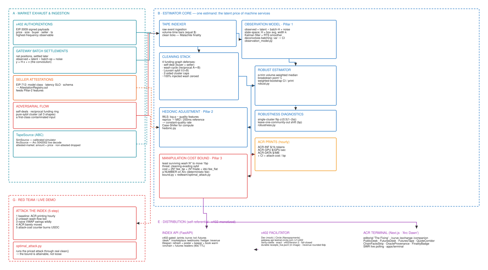
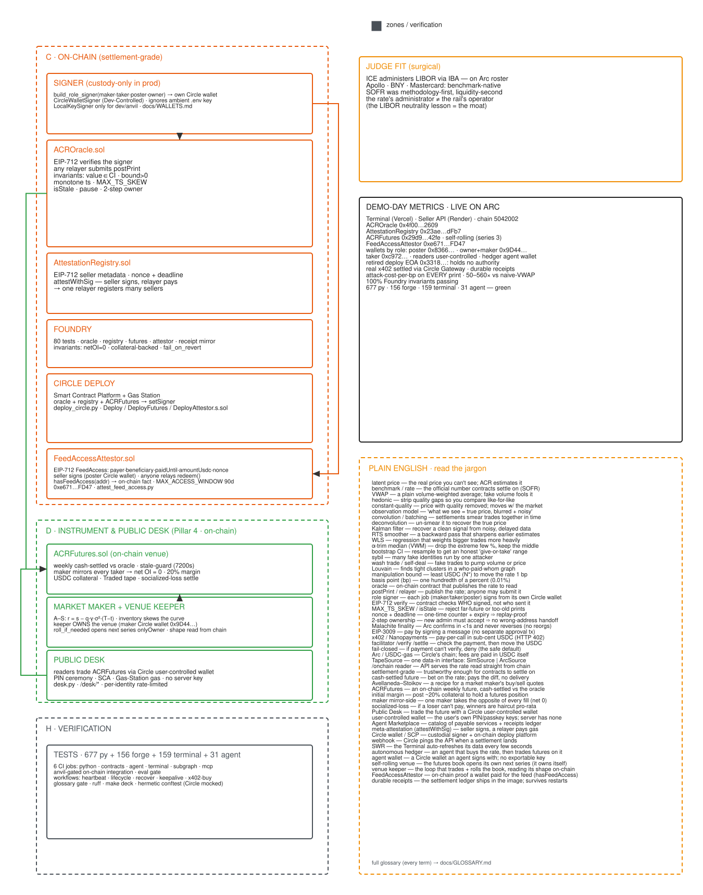
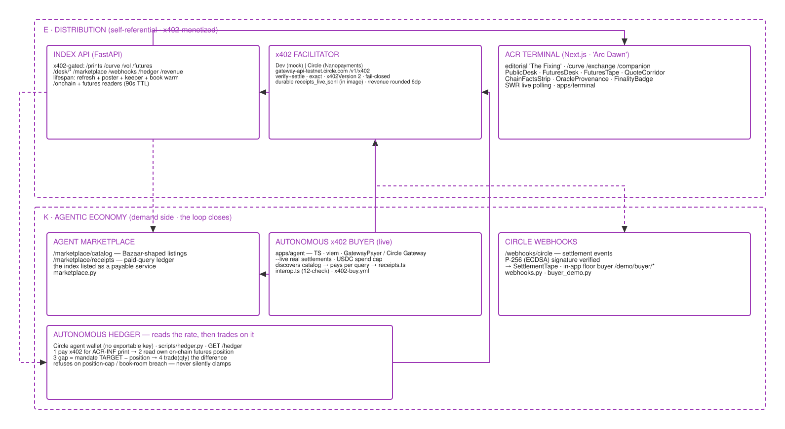

# ACR — Arc Compute Rate · Final Submission

**Arc × Circle · Agentic Economy track · 10 Aug 2026 ·**
`arc-compute-rate.vercel.app` **·** `github.com/kaustubh76/ACR---Arc-Compute-Rate`

Nine sections, one per required item: title, description, track, Circle account email, products
used, working MVP, architecture diagram, documentation, and product feedback. Every figure in
this document is either permanently on-chain or re-measured in CI, so nothing here can drift
between writing and judging.

---

## 1 · Project title

```text
ACR — Arc Compute Rate
```

Tagline, where the form allows one: *"Machine commerce just got its SOFR, and it prints its own
attack cost."*

---

## 2 · Description

**In one paragraph:**

```text
ACR is SOFR for machine commerce: a manipulation-resistant reference rate family (inference, GPU, data) recovered from the noisy, adversarial payment exhaust on Circle's Arc L1 and published hourly on-chain. Every print carries its confidence interval and the USDC an attacker must burn to move it one basis point. The rate is sold to machines over x402 nanopayments, an on-chain futures venue cash-settles against it, and an autonomous agent on a Circle agent wallet buys the print and hedges with it, with no human in the loop.
```

**In full:**

```text
Agents already pay per call for inference, GPU time and data, and they pay whatever it costs that hour. There is no benchmark, so there is nothing to hedge with, nothing to write a term contract on, and no basis for credit. A naive volume-weighted average cannot be that benchmark: our own red team moved one 122 percent with 8,000 dollars of wash trades.

ACR is the fix. A four-pillar estimator recovers the constant-quality price of machine work from Arc's payment exhaust and posts it hourly to an on-chain oracle, signed by a Circle custody wallet. Under the same 8,000 dollar attack ACR moved 0.20 percent, which is 562 times more resistant, and every print publishes what moving it would cost in USDC per basis point. An on-chain futures venue cash-settles against the print and refuses any print older than two hours, so the feed has a dependent that breaks when the feed breaks. Three of its rounds have already run a full life on-chain: opened, traded for a week, expired, settled in cash, collateral released.

The loop already runs by itself. An autonomous agent on a Circle agent wallet pays 0.0001 dollars for the print over Circle Gateway, reads its own book on the venue, and trades the gap to its mandate. Both legs are public state that no one has to take the agent's word for: its payments are Gateway batch references on a public receipts tape, and its position is an Arc transaction.
```

**Why machine commerce matters, in its three services.** Machine commerce is machines buying the
three inputs every agent runs on. **Inference** is the model calls an agent thinks with, priced
per thousand tokens. **Compute** is the GPU time it rents to run and train on, priced per GPU
second. **Data** is the bytes it moves to feed both, priced per megabyte. Together these three
are an agent's entire cost base, every one of them is bought per call at a floating price, and
until now none of them had a benchmark. ACR prints one index per service: **ACR-INF** for
inference, **ACR-GPU** for compute, and **ACR-DATA** for data.

The shape of it, in one breath. **Measure:** the estimator turns payment exhaust into an EIP-712
print signed by a Circle custody wallet. **Sell:** agents pay $0.0001 a query over Circle Gateway
x402. **Settle:** `ACRFutures` fills and cash-settles at that same print, and refuses one older
than two hours. **Hedge:** the agent pays for the number, reads its own book, and trades the gap
to its mandate. A benchmark is a number something settles against, and here the settling contract
breaks when the feed breaks. That is what separates this from a dashboard.

---

## 3 · Track

```text
Agentic Economy
```

Fit, in one sentence: the autonomous hedger answers the track's standing question of whether it
actually works autonomously, and it answers with two separately checkable legs. Its x402 payments
are Gateway batch references on a public receipts tape, and its position is an Arc transaction
(`tx 0x22772154…`). Neither leg asks anyone to take the agent's word.

---

## 4 · Circle account email

```text
kaushtubhagrawal45@gmail.com
```

This is the developer console account whose Developer-Controlled wallets sign every oracle print,
own the futures venue, and stand behind the maker. The API usage judges see on this account is the
product running.

---

## 5 · Products used

```text
Arc L1 (4 contracts, native USDC gas), Circle Gateway x402 nanopayments (seller gate plus buyers), Developer-Controlled Wallets (press, maker, taker, treasury), User-Controlled Wallets with Gas Station (the Public Desk, PIN ceremony), Agent Wallets with the Circle CLI (the autonomous hedger), Unified Balance Kit (agent-run Gateway deposits), Circle webhooks (signed inbound), Agent Marketplace (Discovery-shaped catalog plus a public receipts tape; listing submitted), and Circle Skills (four consumed, one published back: acr-hedge).
```

| Product | The job it does in ACR | Evidence |
|---|---|---|
| Arc L1 | The chain itself: ACROracle, ACRFutures, AttestationRegistry and FeedAccessAttestor, with USDC as the gas token. Deterministic USDC fees are what make the attack cost arithmetic instead of a distribution. | chain `5042002` · testnet.arcscan.app |
| Gateway x402 | Both sides of the paywall. The seller gate verifies and settles EIP-3009 payments, and agents pay $0.0001 a query. | 36 settled queries · batch-UUID receipts on the public tape |
| Developer-Controlled Wallets | The cast's payroll. The press signs hourly prints, the maker owns and collateralises the venue, the taker heartbeats it, the treasury funds them. | signer `0x8366968f…` · maker `0x9D44A7Dd…` |
| User-Controlled + Gas Station | The Public Desk. A stranger opens an SCA in the browser with a PIN, trades the venue for real, and withdraws. Sponsorship is proven from the ERC-4337 paymaster event. | 4 non-operator SCAs have traded; 2 cleared in settled rounds |
| Agent Wallets + Circle CLI | The hedger. The SCA trades while its backing EOA pays for prints, because EIP-3009 needs a signature ecrecover can verify. Circle's own CLI also paid the gate end to end. | agent `0x1Dc707E3…` · fill tx `0x22772154…` |
| Unified Balance Kit | `make gateway-deposit` is the Gateway top-up an agent runs for itself instead of a human running the CLI. | real 0.5 USDC deposit, tx `0xd6bab6ee…` |
| Webhooks | Signed inbound receiver for Circle notifications. | `/webhooks/circle`, signature-checked |
| Agent Marketplace | A Discovery-shaped catalog of 13 priced resources, plus the public settlement tape the terminal's storefront buys from. | `/marketplace/catalog` · listing submitted 04 Aug |
| Circle Skills | Consumed Circle's four and published one back. `skills/acr-hedge` teaches any agent the discover, pay, read venue, hedge loop. | `skills/acr-hedge/SKILL.md` |

**Not used, and said plainly:** Smart Contract Platform and CCTP. Every contract went out through
Foundry; `deploy_circle.py` exists and is tested but has never deployed anything, and a tested
code path is not a shipped one. CCTP is out by construction: the benchmark stays on one chain
because its dependents live where it prints, and a bridge would blur the very thing that makes
the attack cost a number.

---

## 6 · Working MVP

```text
Live terminal: https://arc-compute-rate.vercel.app
Seller API (x402-gated): https://acr-api-1fto.onrender.com
Venue on Arc: https://testnet.arcscan.app/address/0x29d97c629a8278f7ec4218ab0bd8baa9182642fe
Repo: https://github.com/kaustubh76/ACR---Arc-Compute-Rate
Reproduce locally: make setup && make ci && make demo
```

> **Demo video (3:00).** Submitted alongside this brief. The shot-by-shot script it was recorded
> from is `docs/DEMO-SCRIPT.md`.

**Ten-second checks a judge can run:**

- **The site is live against Arc, not a recording of it.** On `/sellers` press *read it from the
  chain* twice. The block number lands, then lands higher.
- **Real settlement on camera.** On `/exchange` open a listing and press *buy this one* at
  $0.0001. A real Gateway batch reference lands and the public tape gains a row.
- **The autonomous agent, both legs.** `GET /hedger` shows its x402 receipts (off-chain batch
  references) beside its on-chain position and fill.

**Standing on-chain evidence, permanent and linkable:**

| Fact | Value |
|---|---|
| Three settled rounds | `#2 @ 0.49533` (tx `0xf094befc…`) · `#1 @ 0.49533` (tx `0x5351bd0c…`) · `#0 @ 0.49270` · cash, final, collateral released. Two of the cleared wallets are outside the operator set. |
| The hedger's fill | `buy 0.24 @ 0.49773` · tx `0x22772154ff8deb5ef43001af8c98fecd36ae2dc70cfe437965c90f68d0041834` · position 2.47 → 2.71 |
| Resistance ($8,000 wash attack) | naive VWAP +110.8% vs ACR +0.20%, which is 562×. The 12-hour eval: 5703.9 bp vs 124.1 bp, which is 46×. CI-gated by `make eval-gate`. |
| Suites, all green | **533 py** · **156 forge** · **106 terminal** · **13 agent** · glossary **426/426** · GitHub CI 6/6 |

**Honesty, stated before it is asked.** The price tape is a *labelled* simulator
(`tape_source: sim`): about 18,500 real Arc settlements collapse to a single price, so no index
is honestly publishable from them yet. And every x402 payer so far is ours. The plumbing is
proven; the demand is not. The site says this too.

---

## 7 · Architecture diagram

The architecture in three readable bands, freshly rendered from the live canvas
(`acr_architecture.excalidraw` in the repo root). The full canvas, with every box mapped to the
module that implements it, is `docs/ARCHITECTURE-DIAGRAM.md`. It earns the phrase implementation
accurate because CI holds it to that: `make verify-claims` re-measures the suite counts the
canvas states, and `make glossary-check` requires all 426 of its terms to be defined.

**Band 1 · from exhaust to print, under attack.** Market exhaust and ingestion feed the
four-pillar estimator core: observation model, cleaning stack, hedonic adjustment, manipulation
cost bound, then the hourly ACR prints with CI and attack cost. The red team lives in the same
band because it attacks the very index it defends.



*Tape → clean (wash · sybil) → deconvolve (Kalman/RTS) → α-trim median + hedonic → print + CI +
attack cost.*

**Band 2 · settlement grade, on Arc.** The Circle-custody signer relays each EIP-712 print to
ACROracle; AttestationRegistry and FeedAccessAttestor sit beside it; ACRFutures cash-settles
against the print, with the Public Desk on top; verification closes the column.



**Band 3 · distribution and the agentic economy.** Distribution sells the print over x402
through the index API, the facilitator and the terminal, and the agentic economy closes the
loop: the marketplace lists it, the buyer and the webhooks consume it, and the autonomous hedger
buys the number and trades on it.



---

## 8 · Documentation

```text
Judge's one-pager: docs/SUBMISSION.md, where every claim sits beside its evidence and every gate carries the date it last ran. Methodology: docs/methodology.md. Architecture: docs/ARCHITECTURE-DIAGRAM.md. API reference: docs/acr-openapi.md. How to run: IMPLEMENTATION.md (make setup && make ci && make demo).
```

| Document | Its one job |
|---|---|
| `README.md` | The front door: what ACR is, demo day metrics, how to use it. |
| `docs/SUBMISSION.md` | The one-page status for judges. Every claim sits beside its evidence, and every gate is dated. |
| `docs/methodology.md` | The estimator spec: four pillars, published before liquidity, the way SOFR was. |
| `docs/ARCHITECTURE-DIAGRAM.md` | The implementation-accurate blueprint behind the diagram above. |
| `docs/acr-openapi.md` | The API endpoint by endpoint, mirrored live at `/developers`, where every free endpoint runs from the page. |
| `docs/WALLETS.md` | Which Circle wallet product does which job, and the constraint that forced each choice. |
| `docs/agent-runbook.md` | The Circle CLI path: create, fund, deposit, pay. Proven end to end. |
| `docs/GLOSSARY.md` | 426 terms, CI-gated against the diagram, so no jargon goes undefined. |
| `docs/TESTNET_RUNBOOK.md` · `DEPLOY.md` | The ordered operator sequences for going live on Arc and deploying the cloud pair. |
| `docs/PITCH.md` · the pitch deck | The 8-slide deck (`docs/pitch`, rendered by `make pitch`) and the spoken argument with objection handlers. |
| `docs/DEMO-SCRIPT.md` · teleprompter | The 3-minute video beat by beat, re-verified against production on 10 Aug. |
| `skills/acr-hedge/SKILL.md` | The published Circle Skill. It teaches any agent the loop, with the two gotchas that cost us most. |

---

## 9 · Product feedback

```text
All of this was measured while building on the full stack (Gateway x402, all three wallet models, the CLI, Unified Balance Kit, webhooks, Skills) on Arc testnet.

What impressed us: Gateway nanopayment batching worked exactly as documented at $0.0001 per call, Gas Station sponsorship is cleanly provable from the ERC-4337 paymaster event, hosted PIN custody explains itself on camera, and publishing a Skill took an afternoon.

Findings that cost real debugging time: (1) circle wallet execute cannot build a transaction carrying a negative int256, so an agent can open a position but never close one, which makes autonomy one-directional; (2) services pay buries the Gateway batch UUID in base64 inside data.payment.receipt; (3) Circle APIs return lowercase addresses, which web3.py rejects in a way that looks like throttling; (4) the w3s challenge callback never fires on an already completed challenge, so resuming a PIN ceremony needs a status poll; (5) the hosted PIN flow gates on typing the words "I agree", which is undocumented; (6) sponsorship appears as a paymaster event, not in networkFee; (7) Arc eth_getLogs has a hard cap near 15,000 blocks plus 429 throttling that must never be treated as a range error; (8) Unified Balance Kit getBalances needs chains set to "Arc_Testnet" exactly, or Arc silently reads zero.

Our top asks: list Arc in the Discovery API (it serves 958 listings today and none are on Arc, so our submitted listing cannot be found by the very agents this track is about), platform-enforced spend policies for agent-held wallets, event push instead of log polling, and cross-chain funding of an Arc seller through Gateway's unified balance.
```

**What worked, and impressed:**

- **Gateway nanopayment batching, end to end.** The 402, the EIP-3009 authorization and the
  batch settlement worked exactly as documented at $0.0001, and our 402 parses byte-identically
  in Circle's own `GatewayClient` (12/12 interop, re-run against the deployed gate).
- **Gas Station.** Sponsorship is cleanly observable from the ERC-4337 `UserOperationEvent`
  paymaster, which let us prove sponsorship instead of asserting it.
- **Hosted PIN custody.** A stranger provisions an SCA and trades in a browser while the key
  never touches our server. The trust story explains itself on camera.
- **Skills.** The plugin model was easy to consume and easy to publish back; `acr-hedge` took an
  afternoon.

**Measured integration findings, each with why it bites.** Reproduction detail lives in the
repo's `CIRCLE-SESSION-QUESTIONS.md`.

| # | Finding | Why it bites |
|---|---|---|
| 1 | `circle wallet execute` cannot build a transaction carrying a **negative int256**. Verified with controls: `eth_call` succeeds, and an actual revert produces a different error. | An agent can open a position and never unwind it. Autonomy becomes one-directional. |
| 2 | `services pay` buries the Gateway batch UUID in base64 inside `data.payment.receipt`. | The one reference that ties a payment to its settlement is invisible to a script reading the obvious fields. |
| 3 | Circle APIs return **lowercase addresses**, and web3.py rejects input that is not checksummed. | The failure presents as throttling rather than a format error, and it sends debugging in the wrong direction for hours. |
| 4 | The w3s SDK challenge callback **never fires on an already completed challenge**. | Resuming a PIN ceremony needs a status poll. The documented callback path silently hangs. |
| 5 | The hosted PIN flow gates on literally typing the words **"I agree"**, which is undocumented. | It stalls E2E and demo automation, and nothing in the flow says why it is waiting. |
| 6 | Sponsorship appears as a paymaster event topic, **not** in `networkFee`. | Fee accounting that reads the obvious field mis-reports sponsored transactions. |
| 7 | Arc `eth_getLogs`: a hard cap near 15,000 blocks (413), string `toBlock` rejected, plus 429 throttling. | Backing off the *range* on a 429 collapses read reach. A throttle must never be treated as a range error. Measured: a 7.9 hour walk collapsed to 1,264 blocks, about 11 minutes. |
| 8 | Unified Balance Kit `getBalances` needs `chains: "Arc_Testnet"` spelled exactly. | Without it, Arc silently reads zero, which is indistinguishable from an unfunded wallet. |

**The asks, in priority order:**

- **Arc in the Discovery API.** Circle's marketplace serves 958 listings, every one on a mainnet
  chain and none on Arc, so an Arc-native seller that meets every listing prerequisite cannot be
  discovered by the very agents this track is about. Our listing is submitted and waiting on
  exactly this.
- **Platform-enforced spend policies for agent-held wallets:** per-transaction caps, allowlisted
  contracts, rate ceilings. Today the guardrails around an autonomous key are all client side,
  which makes them promises rather than properties.
- **Event push over log polling.** The getLogs limits above make an agent's view of the world a
  paged crawl. A webhook or stream for contract events on Arc would remove our largest source of
  operational fragility.
- **Cross-chain funding of an Arc seller through Gateway's unified balance.** It is the one rail
  this project does not use yet, and it would let any judge fund a buyer from whatever testnet
  USDC they already hold.
