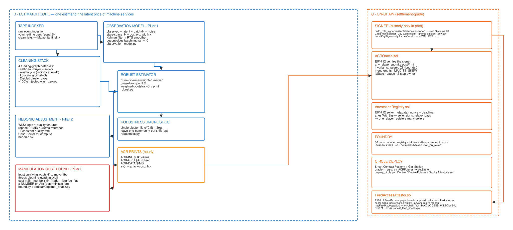

<!-- _class: lead -->
<!-- _paginate: false -->
<!-- _footer: "" -->

###### ARC / CIRCLE 7-WEEK HACKATHON · AGENTIC ECONOMY TRACK · FINAL SUBMISSION

# ACR — the Arc Compute Rate

## Machine commerce just got its **SOFR** — and it prints its own **attack cost**.

A manipulation-resistant reference rate for machine services, live on Arc testnet — and the cash-settled futures venue that trades on it.

`arc-compute-rate.vercel.app` · `github.com/kaustubh76/ACR---Arc-Compute-Rate`

<!-- Open cold: every financial market runs on a reference rate. Machine commerce — agents buying inference, GPU time, bandwidth — has none. We built it, it's printing on-chain right now, and by slide 3 you'll meet its first customer. -->

---

###### THE PROBLEM

# Agents trade machine services with **no trustworthy price**

- Agents already pay per call for inference, GPU time, and data — but there is **no benchmark** to settle contracts against or hedge with.
- The raw payment exhaust is **noisy, batched, and adversarial**.
- A naive volume-weighted average is an open invitation: our own red team moves it +122% with wash trades.

> No benchmark means no hedging, no term markets, no credit. Machine commerce is stuck at spot.

<!-- Key beat: this is benchmark construction, not a dashboard. Everything downstream depends on the print being manipulation-resistant. And the next slide is who pays for that gap. -->

---

###### THE USE CASE · WHO NEEDS THIS NUMBER

# Meet the hedger: an agent business with a floating USDC burn

- **Portia**, an autonomous paralegal fleet, resells LLM work at fixed prices but pays for inference per call — ~**100M tokens/mo × 0.49236 $/1k tokens** (the ACR-INF print) ≈ **$49,236/mo**, all floating. One +10% month is **+$4,924** of unbudgeted burn.
- The fix: go **long ACR-INF futures**. Cash-settled — at expiry the venue **freezes the freshest oracle print** (≤ 2 h old, enforced on-chain) and pays the difference in USDC. **No delivery, no GPU repossession, no seller cooperation.**
- A hedge is only as good as its settlement print: every ACR print ships its **CI** and its **attack-cost-per-bp**, so both sides can read — on-chain — what bending the settle would cost.
- **This loop is live on Arc testnet:** `ACRFutures 0x29d97c62…82642fe` — ACR-INF, 10× multiplier, 20% initial margin, socialized-loss clearing, settling against the same ACROracle. The maker standing behind the book is a **Circle developer-controlled wallet**, and an **autonomous agent buys the print over x402 and trades on it**. Watch both on `/curve`.

<!-- Every compute future before this died one of two deaths: physical delivery you can't enforce, or cash settlement against an index you can bend. We amputated delivery — "capacity forwards with the hardest organ amputated" — and made bending priced. Portia's math is a worked example at the ship-week print; the venue is testnet-scale by design (10× multiplier). The mechanism, not the notional, is the product. -->

---

###### THE PRODUCT

# Three indices, live on Arc testnet — chain `5042002`

| Index | Measures | Latest on-chain value |
|---|---|---|
| **ACR-INF** | Inference — $/1k tokens | **0.49236** |
| **ACR-GPU** | GPU compute — $/GPU-sec | **0.01110** |
| **ACR-DATA** | Data egress — $/MB | **0.00209** |

Every hourly print ships **three numbers**: the rate, a confidence interval, and the **attack-cost-per-bp** (ACR-INF ≈ **0.0094 USDC/bp**).

Read live from ACROracle at final submission — posted **hourly, in-cloud, signed by a Circle custody wallet** — and now the print the **futures venue freezes at expiry**.

<!-- LIVE PATH: skim unless asked. The attack-cost-per-bp is the differentiator: the index quantifies its own manipulation cost on every print. The previous slide's hedge settles on exactly these numbers. -->

---

###### THE HEADLINE RESULT

# $8,000 wash attack. The attacker got **≤ 2.39%**.

| Index | naive VWAP moved | ACR moved | Resistance |
|---|---|---|---|
| ACR-INF | +110.8% | +0.20% | **562×** |
| ACR-GPU | +107.1% | −1.02% | **105×** |
| ACR-DATA | +122.5% | +2.39% | **51×** |

36,000 adversarial authorizations; the attacker burned **$147.60** in fees. Claims are **CI-gated** (`make eval-gate`) so they cannot silently drift.

<!-- Run `make demo` live if there's time — one command, about a minute, prints this table. 12-hour series: 46× (VWAP 5703.9 bp vs ACR 124.1 bp attack-window error). -->

---

###### WHY ONLY ON ARC

# Six **mathematical** dependencies — not deployment conveniences

| Arc property | What it buys the estimator |
|---|---|
| Malachite deterministic finality | Clean tick timestamps |
| Gateway: one canonical rail | Complete observation, no selection bias |
| x402 nanopayments | Agents are the index's *paying customers* |
| USDC numeraire | No gas-token deflator in the signal |
| **Deterministic USDC fees** | The attack cost is **a number, not a distribution** |
| Agent Marketplace | Native machine-to-machine discovery |

<!-- The kill-question "why Arc?" answered mathematically: on a probabilistic-fee chain, attack cost is a Monte Carlo estimate. On Arc it's arithmetic. -->

---

<!-- _class: light -->
<!-- _footer: "" -->
<!-- _paginate: false -->

###### ARCHITECTURE · ONE PIPELINE

## Adversarial exhaust in → settleable print out

*Tape → clean (wash · sybil) → deconvolve (Kalman/RTS) → α-trim median + hedonic → print + CI + attack-cost → EIP-712 oracle → futures settle → agents buy the rate back via x402.*

<!-- LIVE PATH: skip unless asked — the caption carries the pipeline for PDF readers. Generated deterministically by scripts/gen_architecture.py. -->

---

###### METHODOLOGY · FOUR PILLARS, ONE ESTIMAND

# Recovering the latent constant-quality price

| Pillar | What it does |
|---|---|
| **Observation model** | Kalman + RTS smoother deconvolves Gateway's settlement batching |
| **Cleaning** | 4 funding-graph defenses (self-deals, wash cycles, sybil clusters, caps) — ~100% of injected wash zeroed |
| **Robust core + hedonic** | Trimmed volume-weighted median (breakdown point ½) + bootstrap CI; quality-adjusted via on-chain seller attestations |
| **Manipulation bound** | Prices the cheapest surviving attack per bp — validated *attainable* by `redteam/optimal_attack.py` |

Full spec: `docs/methodology.md` — published before liquidity, the way SOFR was.

<!-- LIVE PATH: skim unless asked. One analogy per pillar: deblurring a photo; a funding-graph spam filter; Case-Shiller for compute; a published price-of-corruption. -->

---

###### LIVE ON ARC · ALL GATES RE-RUN 2026-07-31

# Deployed, printing, hedgeable — all seven weeks shipped

| Contract / surface | Live proof |
|---|---|
| **ACROracle** `0x4f00e3BD…9092609` | Hourly EIP-712 prints, Circle custody signer |
| **AttestationRegistry** `0x23ae3E1A…2f63dFb7` | 4 seller attestations on-chain |
| **ACRFutures** `0x29d97c62…82642fe` | Live series, **maker is a Circle custody wallet**, cash-settles on the print |
| **Terminal + Seller API** | API x402-gated at **$0.0001/query**, fail-closed |

`make ci` green 2026-08-03: **281 py** · **50 forge** (incl. futures + invariants) · **55 terminal** · **10/10 agent** · resistance **4/4** · interop **12/12** · glossary **386/386** · GitHub CI **4/4**.

Real settlement through **Circle Gateway** — batch-UUID receipts in-repo and on the public `/exchange` tape; Circle's own CLI paid the gate (`payable`).

Provenance labeled on every value — `sim` / `gateway-ref` / `tx`. Reproduce: `make setup && make ci && make demo`.

<!-- LIVE PATH: skim — one breath on addresses, then: three make commands reproduce every claim. The honesty tiers earn trust: sim is labeled sim, and flat query fees are never laundered into the index as prices. -->

---

###### THE LIVE DEMO · 4 MINUTES

# Attack the index, then hedge on it

1. `/` — the print ticking live: rate + CI + attack cost. New to the jargon? Flip the masthead to **plain** — the whole paper re-sets in plain English.
2. `/attack` — press the button: wash flow floods in, naive VWAP swings ~+110%, **ACR holds**, and the counter burns the attacker's USDC. Offline twin: `make demo` — one command, ~1 minute.
3. `/curve` — the term structure, the **live futures desk** read from ACRFutures on-chain, and **the Public Desk: trade it yourself.** Open a Circle *user-controlled* wallet in the browser (your PIN, our gas), take the stake, place a real fill, withdraw it again — the key never leaves your device, so every step is a challenge only your PIN can sign.
4. `/exchange` — real Gateway settlements on the tape; paper trail in `docs/SUBMISSION.md`.

**Live:** https://arc-compute-rate.vercel.app · reader's companion at `/companion`

<!-- LIVE PATH: this is the cutaway. Demo prep: hit /health five minutes early (free-tier press wakes in ~60 s); if still cold, the Terminal labels the tier honestly and reads ACROracle directly — even the fallback is on-chain truth. make demo needs no network. Series rolls are automated (futures-lifecycle.yml); `make desk-preflight` confirms the venue is tradable before a session. The Public Desk needs a PIN ceremony per action, so allow ~30 s per step live. -->

---

<!-- _paginate: false -->
<!-- _footer: "" -->

###### WHY THIS WINS

# The rate machine commerce settles on

- **Judge fit:** ICE — a benchmark administrator — is on Arc's testnet roster; Apollo, BNY, Mastercard are rate-native.
- **The neutrality moat:** Circle can't own the benchmark (the LIBOR lesson) — ACR is a partner, not a feature.
- **The loop closes:** resistant print → on-chain oracle → **cash-settled futures** + x402-paying machine customers → attestations → a better print.
- The first machine-commerce benchmark with a **live derivative venue** — a term structure from day one.

**Terminal** `arc-compute-rate.vercel.app` · **API** `acr-api-1fto.onrender.com`
**Contracts** `0x4f00e3BD…` / `0x23ae3E1A…` / `0x29d97c62…` on `testnet.arcscan.app` · `docs/SUBMISSION.md`

<!-- Close on the tagline: "Machine commerce just got its SOFR — and it prints its own attack cost." Live path: 1 → 2 → 3 → 5 → 6 → demo → here. -->
